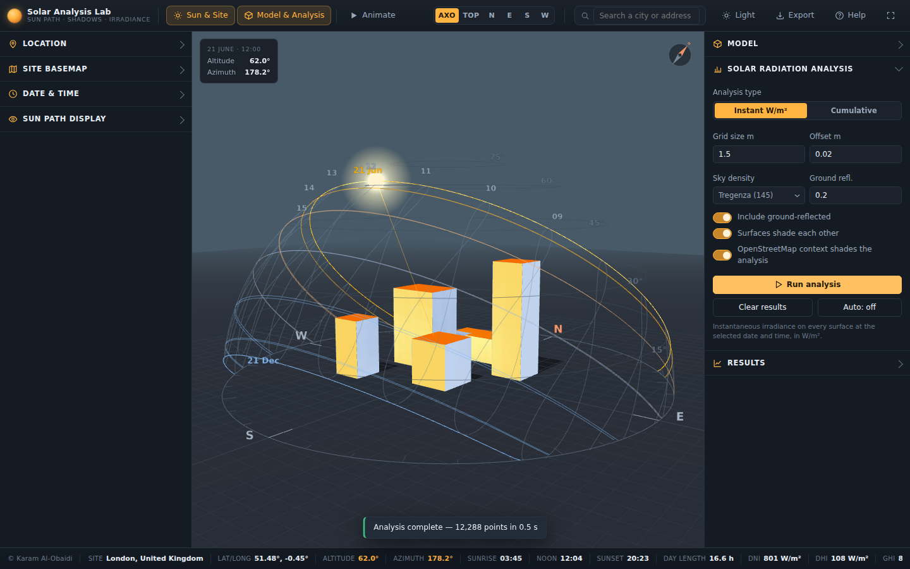
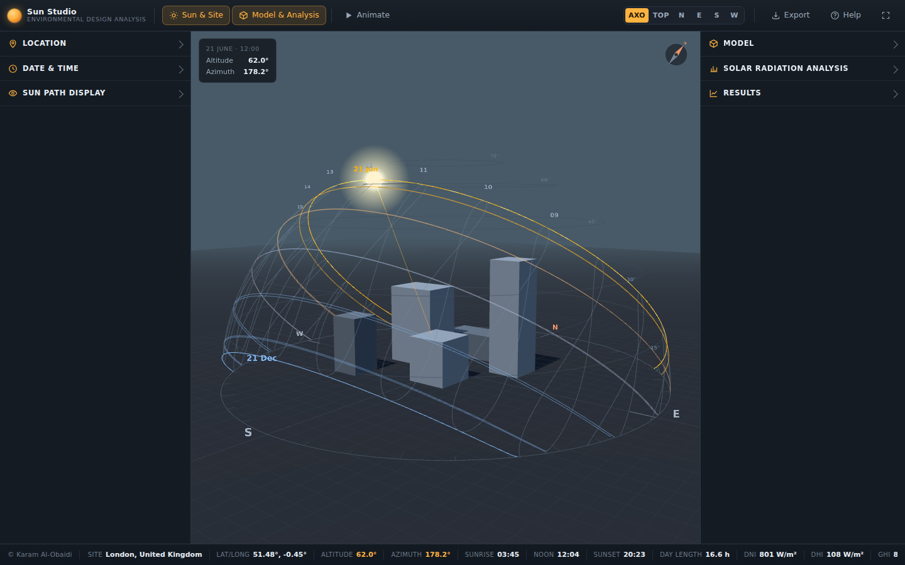
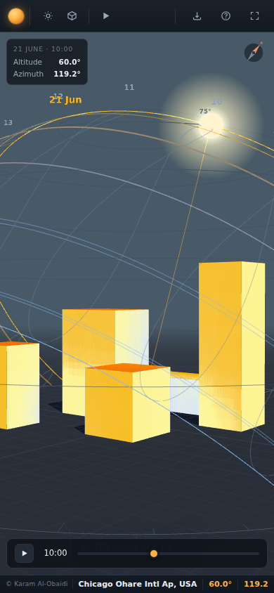
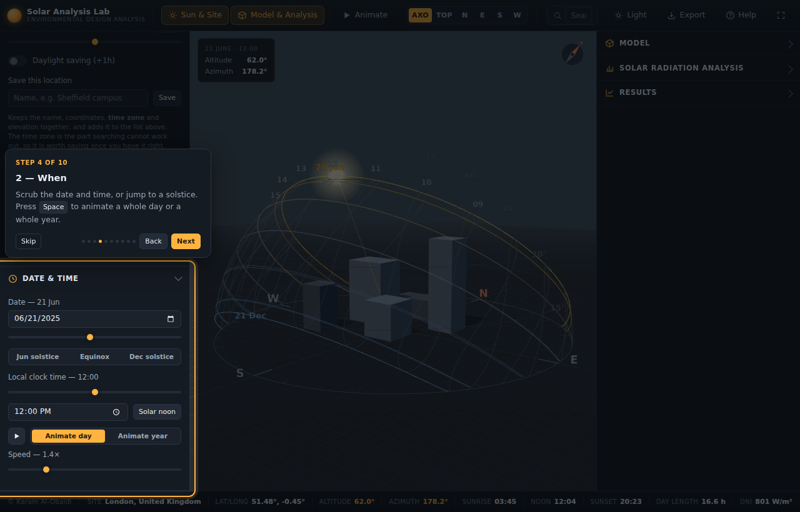
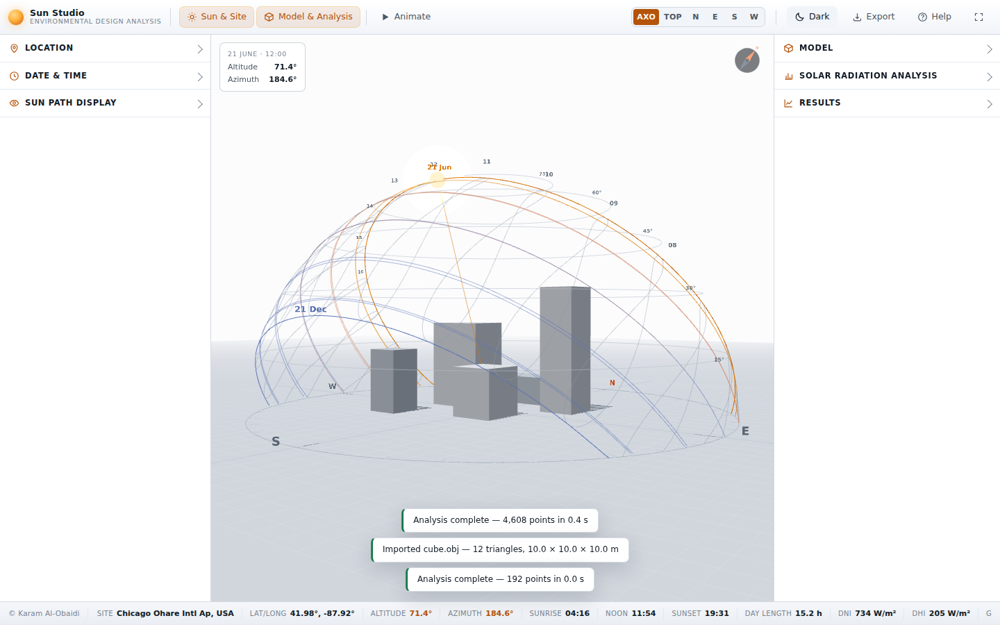
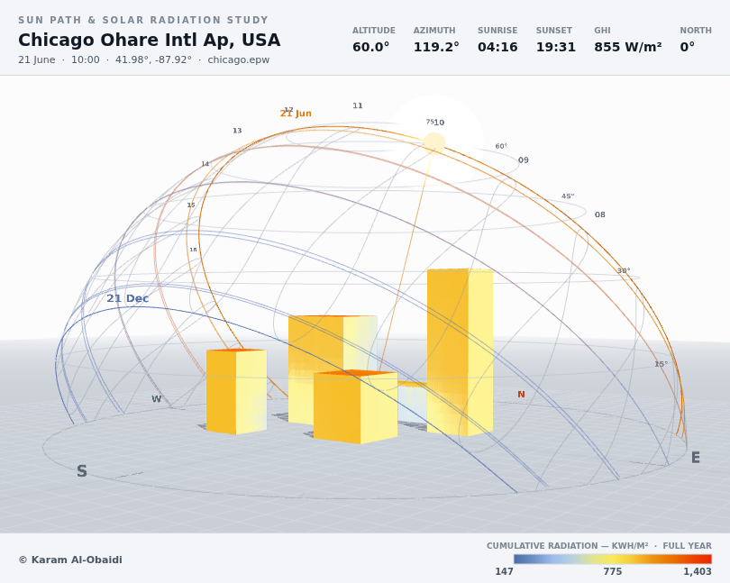

# Sun Studio

**Sun Studio** is an interactive 3D sun-path and solar-radiation analysis tool for teaching environmental
design to architecture students. It runs entirely in the browser from a **single
responsive HTML file** that drops straight into a WordPress page.

Students can move the sun through the day and the year, watch shadows fall across a
massing model, import real climate data and their own geometry, and then compute the
**solar irradiance in W/m² on every surface** of the building.



<sub>Cumulative annual radiation on the demo massing, Chicago O'Hare TMY3.
Below: the first-load state (London, clear-sky model) and the phone layout.
`npm test` regenerates all of these into `tests/screenshots/`.</sub>

| First load | Phone |
|---|---|
|  |  |

---

## What it does

| | |
|---|---|
| **Dark and light presentation** | The whole interface and the 3D scene switch together, live — dark for the studio and the lecture theatre, light for print, handouts and projectors that wash out. The choice is remembered, and exports default to whichever is on screen. |
| **Guided first-run tour** | A ten-step walkthrough starts automatically the first time a student opens the page, spotlighting each control in turn. It is non-blocking — the model stays draggable while it runs — and replays any time from **Help**. |
| **3D sun path for a full year** | Hourly analemmas, monthly sun-path arcs, solstice and equinox highlights, compass rose with bearings, altitude rings, animated sun. |
| **Real-time shadows** | A shadow-casting sun light driven by the true solar position, with day and year animation. |
| **Solar radiation on all surfaces** | Instantaneous irradiance in W/m², or cumulative radiation in kWh/m² over any period, mapped face-by-face onto the model. |
| **Real climate data** | Drag in any EnergyPlus `.epw` weather file — location, time zone and 8 760 hours of DNI/DHI/GHI are read straight from it. |
| **Your own geometry** | Import an `.obj` model with unit scaling, up-axis selection, centring and drop-to-ground. |
| **Results you can use** | Legend with selectable colour schemes, a by-orientation summary table (roof, N, NE, E … NW, soffit), and CSV export of every analysis point. |
| **Presentation-ready image export** | One click produces a titled study sheet: the view cropped to its content, with site, date, time, sun angles and the legend burned in — in dark or in a light print theme, at up to 3× resolution. |

---

## Putting it on a WordPress page

The app is one self-contained file. `three.js` is loaded from a CDN, so the page needs
internet access — which any live WordPress site has.

### Option 1 — iframe (recommended)

1. **Media → Add New** and upload `index.html`.
   *If WordPress blocks `.html` uploads*, upload it by FTP/File Manager instead to
   `/wp-content/uploads/sunpath/index.html`.
2. Edit your page, add a **Custom HTML** block, and paste:

```html
<div style="position:relative;width:100%;max-width:1600px;margin:0 auto;
            aspect-ratio:16/10;min-height:520px;border-radius:10px;overflow:hidden;
            box-shadow:0 6px 28px rgba(0,0,0,.28)">
  <iframe src="/wp-content/uploads/sunpath/index.html?embed=1"
          title="Sun Studio — sun path and solar radiation analysis"
          style="position:absolute;inset:0;width:100%;height:100%;border:0"
          allowfullscreen loading="lazy"></iframe>
</div>
```

The `aspect-ratio` keeps it responsive on phones; `min-height` stops it collapsing.
`?embed=1` hides the title block, which is useful in a tight frame.

### Option 2 — full-page template

Upload `index.html` anywhere on the server and link to it. It already fills the
viewport (`100dvh`) and needs no theme CSS.

### Option 3 — offline / intranet

If the site has no route to the CDN, download the three files the importmap
requests and change the two importmap URLs to local paths:

```
build/three.module.js  +  build/three.core.js
examples/jsm/controls/OrbitControls.js
examples/jsm/loaders/OBJLoader.js
```

`npm run vendor` fetches exactly these from the published npm package into
`tests/.vendor/`.

---

## Using it

**First run** — a guided tour walks through the interface one control at a time. Skip it
with `Esc`, replay it from **Help**, or suppress it entirely by adding `?tour=0` to the
URL (useful when projecting the app in a lecture). Add `?tour=1` to force it.



All panel sections start collapsed, so the first thing a student sees is the model
space. Open the ones you need.

**Presentation mode** — the toolbar toggle (or `T`) switches the whole app between dark
and light, interface and 3D scene together. Dark is the default; the choice is remembered
per browser. Light mode is the one to use on a washed-out projector or when the screen is
going into a printed handout.



**Toolbar** — `Sun & Site` and `Model & Analysis` open the two panels; `Animate` plays
the sun; the view cube jumps to plan or elevation views.

**Sun & Site** — pick a preset city or type coordinates, set the time zone, elevation and
project-north rotation, import an EPW, then scrub the date and time. The quick buttons
jump to the June solstice, an equinox and the December solstice.

**Model & Analysis** — choose a sample massing or import an OBJ, set the analysis grid,
sky density and ground reflectance, then **Run analysis**.

- **Instant W/m²** — irradiance on every surface at the selected moment. Turn on
  `Auto` and it recomputes as you scrub time.
- **Cumulative** — total kWh/m² (or period-average W/m²) over the year, a season, a
  month, a day, or a custom date and hour range.

**Export** — the toolbar `Export` button (or `E`) opens a small panel: choose **Dark** or
**Light (print)**, pick 1× / 2× / 3×, and export. The sheet carries the site name, date,
local time, sun altitude and azimuth, project north, the hour's global horizontal
irradiance, the climate source, and — once an analysis has been run — the legend with its
units and period, so the image needs no caption. The render is cropped to the sun path and
the model rather than to the empty viewport. Results CSV is available from the same panel.



<sub>A light-theme study sheet, ready to drop into a report.</sub>

**Status bar** — sun altitude and azimuth, sunrise, solar noon, sunset, day length, and
the hour's DNI/DHI/GHI. It also shows a live **horizontal check**: the irradiance the
app computes on a flat unobstructed surface next to the value in the weather file.
Those two agreeing is the quickest way to confirm the model is behaving.

**Keyboard** — `L`/`R` panels, `Space` play/pause, `T` theme, `E` export, `F` fullscreen, `←`/`→` time
(`Shift` = 1 hour), `↑`/`↓` date (`Shift` = 30 days). During the tour the arrows step
through it and `Esc` dismisses it.

---

## Methodology

The calculation chain deliberately mirrors the Radiance/Ladybug Tools pipeline that
students will meet in practice, so results are comparable with those tools.

**Solar position** — the NOAA solar position algorithm (Meeus, *Astronomical
Algorithms*), including the equation of time and atmospheric refraction. Local clock
time, time zone and an optional daylight-saving hour are handled explicitly.

**Sky subdivision** — the sky hemisphere is divided into **Tregenza (145)** or
**Reinhart (577)** patches, generated with the same construction as Radiance's
`rh_init()`: `alpha = (π/2)/(7·MF + 0.5)`, rows of `{30, 30, 24, 24, 18, 12, 6}·MF`
patches, patch solid angle `2π·(sin α(i+1) − sin αi)/n`, plus a zenith cap.

**Sky radiance** — the **Perez et al. (1993) all-weather model**. The relative radiance
of each patch is

```
L(γ, ζ) = (1 + a·e^(b/cos ζ)) · (1 + c·e^(d·γ) + e·cos²γ)
```

with `a…e` derived from the sky clearness ε and brightness Δ of that hour. The
coefficient table and the parameter equations are transcribed from Radiance
`gendaymtx.c`, including the special overcast-bin forms for `c` and `d` and Radiance's
clamping of ε, Δ. Each hour's patch radiances are then **normalised so that
Σ Lᵢ·Ωᵢ·cos ζᵢ equals the measured DHI exactly** — this is what ties the model to the
weather file rather than to an idealised sky.

**Direct beam** — kept *out* of the sky patches and binned separately on a finer
(~2.5°) altitude/azimuth grid, energy-weighted. Smearing a low sun across 145 coarse
patches is a well-known artefact of the default `gendaymtx` behaviour; binning it
separately keeps low-angle winter sun where it belongs. A Chicago year reduces to
about 590 unique sun directions.

**Ground reflection** — a mirrored emissive hemisphere with radiance
`ρ · GHI / π`, exactly as Ladybug's "ground hemisphere". Default reflectance 0.2.

**Shading** — every analysis point casts an occlusion ray at every source direction
with a positive dot product. Rays are traced against a BVH built over the model
triangles inside a Web Worker, so the viewport stays live and progress is real.

**Analysis grid** — each triangle is recursively subdivided into four until its area is
below the grid size squared, giving one sensor per sub-triangle with its own area
weight. This works on arbitrary imported meshes, not just planar surfaces.

**Clear-sky fallback** — with no EPW loaded the app synthesises a clear day from
Hottel's (1976) beam transmittance and the Liu–Jordan (1960) diffuse correlation.
It is clearly labelled as synthetic; it is not real climate.

---

## Validation

`npm test` runs 72 headless checks. Every number below is produced by that suite, not
asserted by hand.

| Check | Result |
|---|---|
| London equinox solar-noon altitude vs `90 − latitude + declination` | 38.99° vs 38.97° |
| London 21 June sunrise / sunset vs published times (GMT) | 03:45 / 20:23 vs 03:44 / 20:22 |
| Sydney 21 June day length, noon sun bearing | 9.89 h, azimuth 360.0° (due north) |
| Tregenza / Reinhart patch counts | 145 / 577 |
| Sky patch solid angles sum to a hemisphere | 6.283185 sr (2π) |
| Perez sky integrates back to the input DHI (4 sky conditions) | exact to 0.5% |
| **Annual radiation, unobstructed horizontal, Chicago TMY3** | **1403.3 kWh/m² vs the EPW's own 1406.6 — −0.23%** |
| Instantaneous horizontal irradiance vs EPW global horizontal (sampled year) | −0.19% |
| Downward-facing surface vs `reflectance × GHI` | 180.0 vs 179.0 W/m² |
| Box in Chicago, annual: roof / south / north | 1403 / 1089 / 416 kWh/m² |
| Box east vs west face (should be near-symmetric) | 841 vs 821 kWh/m² |
| Courtyard block, self-shading on vs off | 586 vs 799 kWh/m² |
| Horizontal overflow at 1440×900, 900×700, 390×844 | none |

The suite also covers the interface: the results table's numeric cells and headers both
compute to `right`, the page declares a dark `color-scheme` so native dropdowns cannot
flash light, focusing a `<select>` does not wipe its chevron, and an image export restores
the live theme and canvas size afterwards. The guided tour is checked end to end: it
auto-starts once, every card stays on screen and clear of the element it points at, the
spotlight passes clicks through, and it does not reappear on the next visit.

Both presentation modes are checked the same way rather than by eye: the toggle moves the
interface and the 3D scene together, the viewport itself re-renders light, the choice
survives a reload, and **measured contrast ratios** clear 4.5:1 for body text and button
labels in each mode — the check that catches a hand-duplicated palette drifting.

### On the dropdown flash

The native `<select>` popups used to flash. Three separate causes, all fixed: the page
never declared `color-scheme`, so the browser drew its popups with the light-mode engine
over a dark page; `<option>` rows had no explicit background; and the focus rule used the
`background` **shorthand**, which resets `background-image` — so clicking a dropdown wiped
its chevron and repainted the whole control through a CSS transition. The focus rule now
sets `background-color` only.

The headline test is the third-from-last group: with no geometry in the way, a year of
Perez skies plus binned direct sun reconstructs the weather file's own measured annual
global horizontal radiation to within a quarter of a percent. That is the strongest
single statement that the solar geometry, the sky decomposition and the energy
bookkeeping are all consistent.

---

## Limitations — worth saying to students

- **No inter-reflection.** Energy bouncing between surfaces is not modelled. Ground
  reflection is the simplified emissive hemisphere only. This is the same scope as
  Ladybug's *Incident Radiation* component, which states the same limitation.
- **Ground reflection and real ground geometry overlap.** The reflecting hemisphere sits
  below the horizon, so a modelled ground plane would block it. Ground is therefore not
  part of the analysis or occluder set.
- **The clear-sky fallback is synthetic.** For any real design decision, import an EPW.
- **Cumulative "average W/m²"** divides by every hour in the period, night included —
  the same convention as Ladybug.
- **Large meshes are slow.** Above ~200 000 triangles the app warns; decimate or use a
  coarser grid. Analysis points are capped at 120 000, with the grid coarsened
  automatically (and a notice) if a setting would exceed that.
- This is a **teaching approximation**, not a substitute for a validated Radiance run.

---

## How it compares to the tools it is modelled on

| | This app | Ladybug Tools | Revit Solar Analysis | Autodesk Forma | IESVE SunCast |
|---|---|---|---|---|---|
| Runs in a browser | ✅ | ❌ (Rhino/GH) | ❌ | ✅ | ❌ |
| Sky model | Perez 1993 | Perez / `gendaymtx` | Perez | proprietary | proprietary |
| EPW climate import | ✅ | ✅ | ✅ | built-in datasets | ✅ |
| 3D sun path diagram | ✅ | ✅ | ✅ (sun path) | ✅ | ✅ |
| Irradiance on surfaces | ✅ W/m², kWh/m² | ✅ | ✅ | ✅ | ✅ |
| Inter-reflections | ❌ | ❌ (Incident Radiation) | limited | limited | ✅ |
| Cost / setup | free, one file | free, needs Rhino | licence | subscription | licence |

Andrew Marsh's *3D Sun-Path* set the interaction benchmark this app follows: everything
rebuilds live on every change, with no "apply" step.

---

## Development

```bash
npm install          # playwright, for the test suite only
npm run vendor       # fetch three.js and the validation EPW
npm test             # 72 headless checks, screenshots and sample export sheets
npm run serve        # serve the folder at http://localhost:8080
```

The test suite intercepts every jsDelivr request and serves it from the copy of the
**published npm package** in `tests/.vendor/`, which doubles as a check that the
importmap URLs point at paths that really exist in `three@0.185.1`. `npm run vendor`
also downloads the Chicago TMY3 EPW used for the physics validation; neither is
committed, so the repository stays small and text-only.

Screenshots land in `tests/screenshots/`.

### Files

```
index.html            the entire app — this is the deliverable
tests/verify.mjs      headless verification and screenshots
tests/fetch-vendor.mjs downloads three.js from the npm registry
tests/assets/         downloaded on demand (Chicago O'Hare TMY3, for validation)
```

---

## Suggested teaching exercises

1. **Latitude** — set the date to 21 June and step through London, Cairo, Singapore and
   Sydney. Watch the sun path flip over at the equator.
2. **Overshadowing** — load *Tower with context* and animate a winter day. Which
   facades never see the sun?
3. **Shading devices** — load *Shaded facade study*, run cumulative radiation for
   May–September, then for October–April. Do the louvres cut summer gain without
   killing winter gain?
4. **Orientation** — load *Single box*, run a full year, and read the orientation table.
   Compare the same box in Chicago and in Singapore.
5. **PV siting** — run cumulative kWh/m² for the year, export the CSV, and in a
   spreadsheet find the surface area above a chosen threshold.

---

## References

- Perez, R., Seals, R., Michalsky, J. (1993). *All-Weather Model for Sky Luminance
  Distribution — Preliminary Configuration and Validation.* Solar Energy 50(3):235–245.
- Perez, R., Ineichen, P., Seals, R., Michalsky, J., Stewart, R. (1990). *Modeling
  Daylight Availability and Irradiance Components from Direct and Global Irradiance.*
  Solar Energy 44(5):271–289.
- Tregenza, P. R. (1987). *Subdivision of the sky hemisphere for luminance measurements.*
- Ward, G., Ashdown, I. — Radiance `gendaymtx`, the reference implementation this
  follows.
- Hottel, H. C. (1976); Liu, B. Y. H. & Jordan, R. C. (1960) — clear-sky correlations.
- NOAA Global Monitoring Laboratory solar position algorithm.
- Ladybug Tools — *Incident Radiation* and *Cumulative Sky Matrix* documentation.

---

© Karam Al-Obaidi
